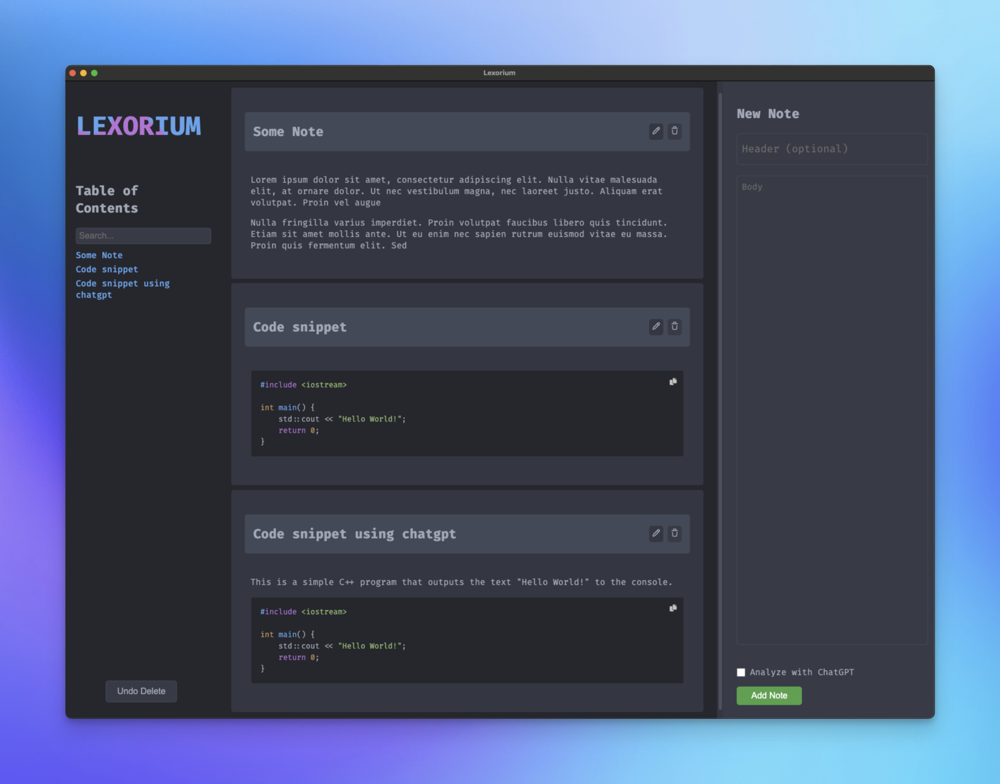

<p align="center">
  
</p>

# Lexorium
*(Derived from "lexicon" and "orium," suggesting a place for words)*

**Lexorium** is an open-source desktop app for managing markdown notes and code snippets. Built with **Tauri 2** and **Svelte 5**, it's fast, lightweight, and native — your go-to tool for capturing text, code, and ideas before they find their final destination.

<p align="center">
  
</p>

## Features

- **Bear-inspired UI** — Clean sidebar + editor layout with depth and polish
- **AI-powered notes** — Generate, enhance, and auto-title notes with OpenAI, Anthropic, or OpenRouter
- **Syntax highlighting** — Full language support with one-click copy on code blocks
- **Dark & light modes** — Follows system preference, with manual toggle via the native menu
- **Search** — Matches titles, content, timestamps, and tags
- **Two-click delete** — Confirmation step prevents accidental deletions
- **Encrypted API keys** — AES-256-GCM encryption stored locally
- **Native macOS experience** — System menus, window controls, and drag regions

## Installation

All releases can be found at [Lexorium Releases](https://github.com/antnsn/Lexorium/releases).

### macOS (Homebrew)

```bash
brew tap antnsn/lexorium
brew install --cask lexorium
```

> **Note:** The macOS app may require manual permission to open due to unverified developer status.
> [How to allow it](https://support.apple.com/en-us/102445)

## Usage

1. **Create notes** — Use the compose panel at the top to add a title, body (markdown), and tags
2. **Edit notes** — Click any note card to open it in the editor, then save your changes
3. **AI enhance** — Click "Enhance with AI" to process a note through your configured provider
4. **Search** — Type in the search bar to filter by title, content, timestamp, or tags
5. **Dark mode** — Toggle via `View` → `Dark Mode` in the menu bar, or let it follow your system

## Development

```bash
cd app
npm install
npm run dev        # Vite dev server (frontend only)
npm run tauri dev  # Full Tauri app with Rust backend
npm run build      # Production frontend build
```

Requires [Rust](https://rustup.rs/) and [Node.js 20+](https://nodejs.org/).

## Contributing

Contributions are welcome! Fork the repo, open issues, or submit pull requests.

## License

**Lexorium** is licensed under the [AGPL-3.0 License](LICENSE).

---

Created with ❤️ by [Marius Antonsen](https://github.com/antnsn).
